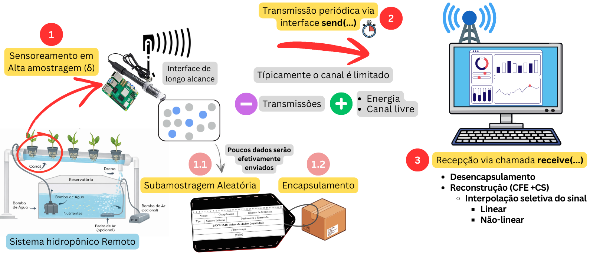

# CFE-HYDRO: Um Protocolo Leve para Reconstrução Progressiva de Sinais Hidropônicos sob Restrições de Comunicação


## Resumo:

O artigo propõe o protocolo CFE-HYDRO, uma solução leve para o monitoramento em tempo real de parâmetros físico-químicos em sistemas hidropônicos (como pH, temperatura, condutividade elétrica e Oxigênio dissolvido), que enfrentam restrições de banda e energia em ambientes agrícolas com infraestrutura de comunicação limitada. O objetivo principal do artefato é permitir a aquisição, transmissão e reconstrução eficiente de séries temporais densas, mesmo quando a taxa de transmissão é inferior à taxa de amostragem dos sensores.

O protocolo fundamenta-se nos princípios da Estimativa de Campo Compressiva (CFE), realizando a amostragem em alta frequência, mas transmitindo apenas um subconjunto aleatório das medições. A inovação central está na incorporação de metadados semânticos que descrevem a natureza do sinal (ex.: logarítmica, sigmoidal, polinomial), permitindo que o receptor selecione e aplique automaticamente o modelo de interpolação ou reconstrução mais adequado (linear, logarítmico, etc.), em vez de depender de interpoladores lineares genéricos.

A avaliação experimental com dados reais de um sistema hidropônico comercial demonstrou que o CFE-HYDRO reduz significativamente o uso do canal de comunicação (ex.: transmitindo apenas 33% das amostras) enquanto mantém alta fidelidade na reconstrução dos sinais. Resultados quantitativos mostraram rápida convergência do erro e capacidade preditiva para horizontes futuros curtos, validando a abordagem para o monitoramento contínuo e a tomada de decisão em tempo hábil sob restrições de recursos.

O protocolo opera na camada de aplicação, utilizando MQTT como transporte, representando uma contribuição prática para o avanço da agricultura de precisão e IoT em cenários com conectividade limitada.

# Estrutura do repositório

```
├── charts  
│   ├── Gráfico 1.tex
│   ├── Gráfico 2.tex
│   ├── Gráfico 3.tex
│   ├── Gráfico 4.tex
│   └── Gráfico 5.tex
├── images  
│   ├── Figura 1.Interpolação Linear vs Interpolação Logarítmica.png
│   ├── Figura 2.Visão geral do funcionamento do CFE-HYDRO.png
│   ├── Figura 3.Estrutura do pacote CFE-HDP.png
│   ├── Figura 4.Reconstrução quantitativa da série temporal de CE.png
│   ├── Figura 5.Convegência do RMSE normalizado.png
│   ├── Figura 6.Capacidade preditiva do sinal transmitido.png
│   └── Figura 7.Impacto da Esparsidade na Precisão.png
├── referencias  
├── src  
│   ├── Analise_estatistica_dados_sensoriados.py
│   ├── Graficos_Estimativa_de_Campo_Compressiva.py
│   ├── Graficos_Resultados.py
│   ├── data
│   │   ├── dataset_cfe-hydro.csv
│   │   ├── resultados_interpolacao.csv
│   │   └── resultados_simulacao.csv
│   └── images
│       ├── boxplot_parametros.png
│       ├── distribuicao_parametros.png
│       ├── eficiencia_por_intervalo.png
│       ├── evolucao_temporal_parametros.png
│       ├── r2_por_intervalo.png
│       └── rmse_por_intervalo.png
├── LICENSE  
└── README  
```

# Selos Considerados

Os autores devem descrever quais selos devem ser considerados no processo de avaliação. Como por exemplo: ``Os selos considerados são: Disponíveis e Funcionais.''

# Informações básicas

O CFE-HYDRO foi projetado para aquisição, transmissão e reconstrução eficiente de séries temporais de parâmetros hidropônicos (como pH, temperatura e condutividade elétrica) sob restrições de comunicação. Para a execução e replicação dos experimentos, é necessário um ambiente composto por:

**Hardware:** Dispositivos de sensoriamento compatíveis com leituras de parâmetros físico-químicos (ex.: sensores de pH, condutividade, temperatura e oxigênio dissolvido), conectados a um sistema de borda (ex.: Raspberry Pi, microcontrolador com conectividade Wi-Fi ou rede de baixo consumo).

**Software:** Implementação do protocolo em linguagem compatível com ambientes IoT (ex.: Python ou C++), utilizando bibliotecas para processamento de sinais (ex.: NumPy, SciPy) e comunicação via MQTT. O protocolo opera sobre um broker MQTT (ex.: Mosquitto) para gerência de mensagens. Os scripts de reconstrução empregam técnicas de Compressive Sensing (CS) e interpolação seletiva (linear, logarítmica, polinomial ou sigmoidal), conforme os metadados transmitidos.

**Dados:** Séries temporais reais de um sistema hidropônico comercial, com amostragem a cada 5 minutos e transmissão a cada 15 minutos, conforme descrito na avaliação experimental.
Para mais detalhes sobre configuração, dependências e exemplos de uso, consulte a documentação no repositório.

# Dependências

Os benchmarks foram realizados em ambiente Python 3.9+, mas versões 3.8+ são compatíveis.
O dataset necessário (dataset_cfe-hydro.csv) está disponível no diretório ./data/ do repositório.
Para a instalação das dependências, executar o seguinte comando:

pip install -r requirements.txt

## Justificativa das dependências:
   - pandas: Utilizado para manipulação de dados CSV e DataFrames em todos os scripts
   - numpy: Necessário para cálculos numéricos, operações com arrays e geração de dados
   - matplotlib: Essencial para geração de gráficos 2D e 3D (inclui mpl_toolkits para gráficos 3D)
   - scipy: Opcional, mas recomendado para funções de interpolação mais avançadas
   - scikit-learn: Opcional, mas recomendado para cálculo de métricas (R², RMSE) com maior precisão

**Observação:** As versões especificadas são as mínimas recomendadas. Os scripts foram desenvolvidos e testados com essas versões ou superiores.

# Preocupações com segurança

Caso a execução do artefato ofereça algum tipo de risco para os avaliadores. Este risco deve ser descrito e o processo adequado para garantir a segurança dos revisores deve ser apresentado.

# Instalação

1.  **Clone o repositório:**

    ```bash
    git clone https://github.com/bps90/cfe-hydro.git
    cd cfe-hydro
    ```

2.  **Crie um ambiente virtual (recomendado):**

    ```bash
    python -m venv .venv
    source .venv/bin/activate   # Linux/macOS
    .venv\Scripts\activate      # Windows
    ```

3.  **Instale as dependências:**

    ```bash
    pip install -r requirements.txt
    ```

# Teste mínimo

Esta seção deve apresentar um passo a passo para a execução de um teste mínimo.
Um teste mínimo de execução permite que os revisores consigam observar algumas funcionalidades do artefato. 
Este teste é útil para a identificação de problemas durante o processo de instalação.

# Experimentos

Esta seção deve descrever um passo a passo para a execução e obtenção dos resultados do artigo. Permitindo que os revisores consigam alcançar as reivindicações apresentadas no artigo. 
Cada reivindicações deve ser apresentada em uma subseção, com detalhes de arquivos de configurações a serem alterados, comandos a serem executados, flags a serem utilizadas, tempo esperado de execução, expectativa de recursos a serem utilizados como 1GB RAM/Disk e resultado esperado. 

Caso o processo para a reprodução de todos os experimento não seja possível em tempo viável. Os autores devem escolher as principais reivindicações apresentadas no artigo e apresentar o respectivo processo para reprodução.

## Reivindicações #X

## Reivindicações #Y

# LICENSE

Este software está sob a _licença-MIT_. Para mais informações, leia o arquivo `LICENSE`.
